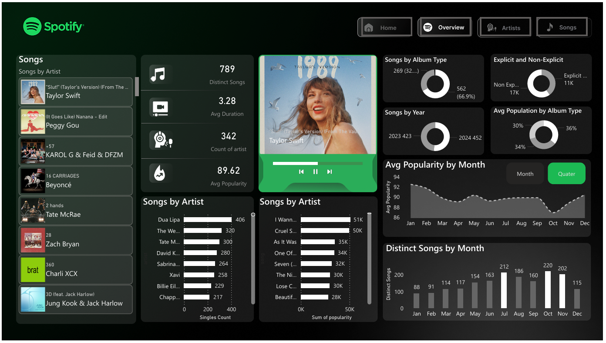

## 🎧 Spotify-Global-Music-Trends-Analysis-Power-BI-

## 📌 Project Overview
This project is an interactive **Power BI dashboard** built to analyze Spotify’s **Top 50 Global Songs** dataset.  
The dashboard provides insights into song popularity, artist performance, album types, explicit content trends, release patterns, and listening behavior over time.

The goal of this project is to transform raw music data into **clear, actionable insights** using data analytics and visualization techniques.

## 📊 Key Features & KPIs
- 🎵 Total Songs
- 🎤 Unique Artists
- ⏱️ Average Song Duration
- 🔥 Average Popularity Score
- 📀 Album vs Single distribution
- 🔞 Explicit vs Non-Explicit songs
- 📈 Songs released by year & month
- 🏆 Best & worst chart positions

## 📈 Dashboard Insights
- **Singles dominate the charts**, indicating higher listener engagement compared to albums.
- **Explicit songs** have a significant presence among top-ranked tracks.
- Certain artists consistently appear in the Top 50, showing strong global influence.
- Average song duration is around **3–4 minutes**, aligning with modern listening trends.
- Newer releases (2023–2024) perform better in chart rankings.
- Popularity varies seasonally, with noticeable peaks in certain months.

## 🧰 Tools & Technologies Used
- **Power BI Desktop**
- **DAX (Data Analysis Expressions)**
- **CSV Dataset**
- **Data Modeling & Transformation**
- **Interactive Visualizations**

## 🗂 Dataset Details
The dataset contains the following columns:
- `date`
- `position`
- `song`
- `artist`
- `popularity`
- `duration_ms`
- `album_type`
- `total_tracks`
- `release_date`
- `is_explicit`
- `album_cover_url`

## 📐 Data Modeling & Measures
Custom DAX measures were created to calculate:
- Total & distinct songs
- Artist count
- Average popularity
- Chart performance metrics
- Album and singles count
- Explicit content percentage
- Average duration and playtime

## 🖼️ Dashboard Pages
- **Overview Page** – High-level KPIs & trends
- **Artist Analysis** – Top artists by popularity and songs
- **Song Analysis** – Song-level performance insights

## 📸 Dashboard Preview

## 🚀 How to Use This Project
1. Download the `.pbix` file from the repository
2. Open it using **Power BI Desktop**
3. Explore the dashboard using filters and slicers
4. Analyze insights interactively

##  Live Dashboard
👉 View the live interactive Power BI dashboard here:  
[https://app.powerbi.com/view?r=XXXXXXXX
](https://app.powerbi.com/groups/me/reports/502bd1d8-0906-45f3-bb6a-92d9b042e99c/c7c051bfa15c9d3cae7c?experience=power-bi)

## 👩‍💻 Author
**Swati Priya**  
BCA | Data Analytics Enthusiast  
Skills: Power BI, SQL, Python, Excel, Data Visualization  
